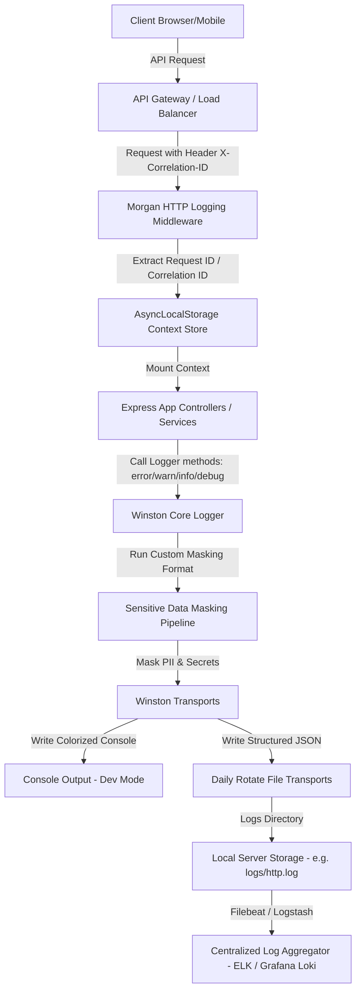
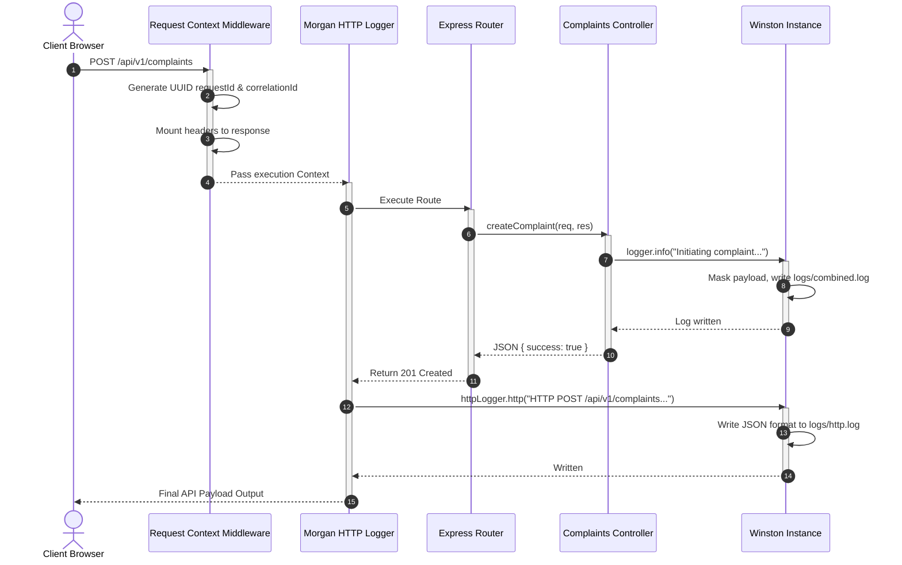
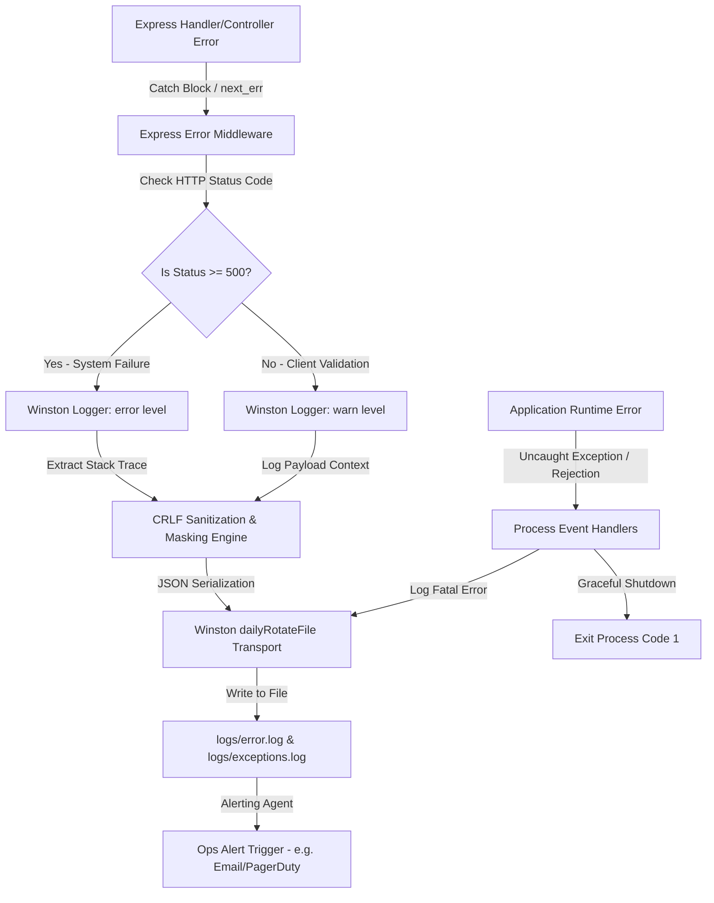
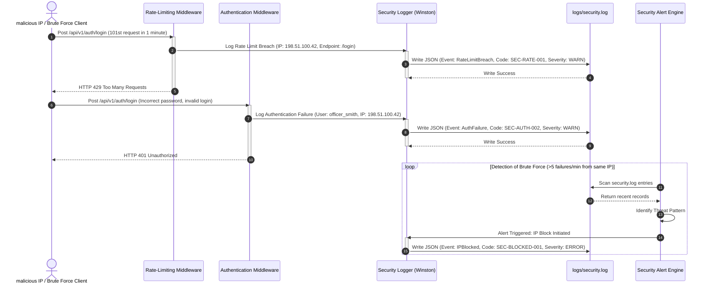
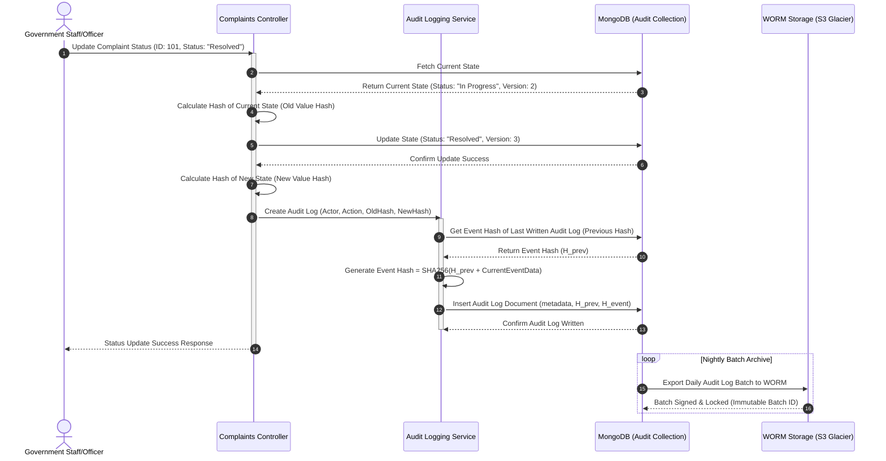

# Smart Municipal Assistance System - Logging Infrastructure Architecture v1.0

## 1. Executive Scope

### 1.1 Purpose
The Logging Infrastructure Architecture v1.0 establishes the enterprise-grade logging and observability standards for the Smart Municipal Assistance System (SMAS). In a modern public sector application processing high-volume transactions, citizen complaints, certificates, and financial reconciliation, logging is a first-class citizen. It serves as the primary system of record for operational observability, post-incident forensics, compliance reporting, security auditing, and performance diagnostics.

### 1.2 Objectives
This architecture provides a blueprint for a unified logging system designed to:
- Establish a zero-loss logging standard for security and audit-grade events.
- Implement comprehensive request tracing and log correlation across asynchronous operations.
- Ensure strict compliance with national privacy and security mandates (such as the Digital Personal Data Protection Act - DPDP Act, GDPR, and government audit guidelines).
- Guarantee zero leakage of Personally Identifiable Information (PII) and credentials.
- Minimize performance overhead on the core Express.js event loop through asynchronous, non-blocking log shipping and rotation.
- Standardize log structures to support seamless ingestion into centralized log aggregators (ELK, Grafana Loki, Splunk, AWS CloudWatch).

### 1.3 Scope
The scope of this architecture encompasses all backend components of the Smart Municipal Assistance System, including:
- **Express.js API Gateway & Services**: HTTP request/response pipelines, auth middleware, and controllers.
- **Data Layers**: MongoDB/Mongoose database interactions, connection state changes, and transaction blocks.
- **Asynchronous Workers**: Background jobs, schedulers, cron tasks, and notification dispatch microservices.
- **Security Interfaces**: Role-Based Access Control (RBAC) validations, biometric verification loops, and authentication flows.
- **Integrations**: Third-party payment gateways, municipal mapping APIs, and notification gateways.

```
+------------------------------------------------------------------------------------+
|                         Smart Municipal Assistance System                          |
+------------------------------------------------------------------------------------+
                                         |
                                         v
+------------------------------------------------------------------------------------+
|                         Core Logging Engine (Winston)                              |
+------------------------------------------------------------------------------------+
     |                 |                 |                 |                 |
     v                 v                 v                 v                 v
+----------+      +----------+      +----------+      +----------+      +------------+
| Console  |      | App/HTTP |      | Security |      |  Audit   |      | Exception  |
| Transport|      |  Files   |      |  Files   |      |  Files   |      | Handlers   |
+----------+      +----------+      +----------+      +----------+      +------------+
     |                 |                 |                 |                 |
     v                 v                 v                 v                 v
[Terminal]      [http.log]        [security.log]    [audit.log]       [exceptions.log]
                [combined.log]                                        [rejections.log]
```

### 1.4 Logging Philosophy
Telemetry is vital to municipal operations. System events must be:
1. **Structured**: Written in normalized, predictable JSON to enable immediate indexing and queryability.
2. **Contextual**: Decorated with metadata (request IDs, correlation IDs, user identifiers, departments, and municipalities) to track events from front-end request down to database transaction.
3. **Immutable**: Security and audit logs must be write-once, tamper-evident, and cryptographically verified.
4. **Sanitized**: Masked at the ingestion point to eliminate credentials, PII, and security tokens from entering log streams.

### 1.5 Benefits & Production Goals
- **Mean Time to Resolution (MTTR)**: Reduced from hours to minutes by providing unified trace vectors.
- **Audit Compliance**: Complete accountability of municipal actions, meeting legal criteria for data integrity.
- **Security Hardening**: Rapid detection of credential stuffing, privilege escalation, and access pattern anomalies.
- **Zero Performance Bottlenecks**: Asynchronous processing with daily log rotation to prevent local disk exhaustion.

---

## 2. Logging Architecture Overview

The logging ecosystem is composed of specialized sub-loggers. Each sub-logger is isolated to target specific operational boundaries, ensuring that sensitive audit logs are not diluted by verbose HTTP traffic, and database queries are not lost in application event traces.

### 2.1 The Dedicated Loggers



#### 2.1.1 Application Logger
The core logger for overall system lifecycles. It tracks initialization milestones, configuration boots, cache invalidations, and system-wide state transitions. It does not record individual request metrics, focusing instead on internal application logic.

#### 2.1.2 HTTP Logger
Captures inbound HTTP requests and outbound responses. It integrates with Express via a customized Morgan wrapper and writes directly to `logs/http.log`.

#### 2.1.3 Exception Logger
Intersects the runtime environment to capture `uncaughtException` and `unhandledRejection` events. It writes stack traces and environment states to `logs/exceptions.log` and `logs/rejections.log` before executing a graceful shutdown sequence.

#### 2.1.4 Audit Logger
Tracks critical business mutations (data changes in complaints, property ownership transfer, and certificate issuance). It computes and stores cryptographic hash chains in the database, writing structural records to `logs/audit.log`.

#### 2.1.5 Security Logger
Monitors authentication, authorization, and rate-limiting triggers. It tracks privilege escalation attempts, password changes, failed logins, and administrative overrides. It writes to `logs/security.log`.

#### 2.1.6 Performance Logger
Extracts time-based measurements of HTTP route execution, slow queries, event loop lag, and system statistics (memory usage, CPU ticks). It outputs to `logs/performance.log`.

#### 2.1.7 Database Logger
Captures MongoDB query behaviors, connection pool states, slow commands, and transaction completions. Helps identify missing indexes or transaction lock contention.

#### 2.1.8 Scheduler Logger
Monitors the execution profiles of cron tasks, background workers, and job queues. It tracks retry timings, scheduling latencies, and execution outcomes.

#### 2.1.9 Authentication Logger
Dedicated to tracking user sign-ins, token issuance, refresh token rotation (RTR) events, biometric authorization scores, and session termination details.

#### 2.1.10 Notification Logger
Maintains telemetry on outbox events: SMS, Email, and Push Notifications. Logs gateway return codes, mail transport failures, and dispatch latencies.

#### 2.1.11 External Service Logger
Monitors integrations with external APIs (payment gateways, geo-mapping providers, government identity systems). It records request-response latency and status codes.

#### 2.1.12 Background Job Logger
Dedicated to long-running tasks, such as PDF certificate generation, spatial processing, and bulk data exports, separating worker logs from web servers.

---

## 3. Logging Levels

The logging infrastructure uses the standard RFC 5424 severity levels. Each log event is labeled with a single level, establishing immediate criteria for alerting, log routing, and search filtering.

### 3.1 Severity Levels Specification

| Level | Numeric Value | Severity Description | Typical Trigger / Event Example | Alert Trigger Actions |
| :--- | :---: | :--- | :--- | :--- |
| **ERROR** | 0 | System or service failure that halts operation. | Database connection pool failure, payment gateway offline, disk full. | PagerDuty, SMS alert, Slack channel ping. |
| **WARN** | 1 | Non-fatal anomaly indicating potential issue. | SLA breached warning, soft validation error, high memory usage (>80%). | Logged to warn/error file, dashboard marker. |
| **INFO** | 2 | Normal operational milestones. | Express server listening, successful complaint registration, backup complete. | Stored in combined logs. |
| **HTTP** | 3 | API network telemetry. | `GET /api/v1/complaints/123 200 45ms` | Stored in HTTP access log file. |
| **VERBOSE**| 4 | Detailed operational sequences. | Token validation success, specific controller routing steps. | Console output (Staging/Dev). |
| **DEBUG** | 5 | Diagnostic parameters for development. | Mongoose query parameters, raw headers, sanitization filters. | Enabled in Dev only. |
| **SILLY** | 6 | Absolute tracing log. | Trace level execution inside loops, raw database cursor pages. | Enabled during deep debug. |

### 3.2 Production Level Recommendations
- **Production Mode**: Minimum logging level set to `info` for general services, and `http` for incoming web traffic. Debug and Silly statements are ignored to prevent storage depletion and execution overhead.
- **Staging Mode**: Level set to `verbose` to capture routing loops and validation decisions without overwhelming test analysts.
- **Development Mode**: Set to `debug` or `silly` with colorized output for maximum local visibility.

---

## 4. Winston Configuration

Winston serves as the core logging engine. The configuration defines how logs are structured, what transports are active, how rotation is enforced, and how process-level exceptions are contained.

### 4.1 Production Winston Configuration File (`config/logger.js`)

Below is the complete, modular configuration script implementing JSON output, daily log rotation, sensitive data masking, and dedicated transports.

```javascript
/**
 * Smart Municipal Assistance System - Core Logging Configuration
 * Filename: config/logger.js
 */

const winston = require('winston');
require('winston-daily-rotate-file');
const path = require('path');
const crypto = require('crypto');

// Environment settings
const ENV = process.env.NODE_ENV || 'development';
const LOG_DIR = process.env.LOG_DIR || path.join(__dirname, '../logs');

// Map of sensitive keys for redaction
const SENSITIVE_KEYS = new Set([
  'password', 'token', 'otp', 'secret', 'authorization', 'cookie', 
  'jwt', 'refresh_token', 'cvv', 'card_number', 'aadhaar', 'pan',
  'biometric_embedding', 'face_match_score', 'template_version'
]);

// PII Regex Masks
const REGEX_AADHAAR = /\b\d{4}[ -]?\d{4}[ -]?\d{4}\b/g;
const REGEX_PAN = /\b[A-Z]{5}[0-9]{4}[A-Z]\b/g;
const REGEX_EMAIL = /\b[A-Za-z0-9._%+-]+@[A-Za-z0-9.-]+\.[A-Z|a-z]{2,}\b/g;
const REGEX_PHONE = /\b(?:\+?91)?[6-9]\d{9}\b/g;
const REGEX_CREDIT_CARD = /\b(?:\d[ -]*?){13,16}\b/g;

/**
 * Recursive sanitization algorithm to redact sensitive keys and PII patterns
 */
function sanitizeObject(obj) {
  if (obj === null || obj === undefined) return obj;

  if (typeof obj === 'string') {
    let sanitized = obj;
    // Replace Aadhaar patterns
    sanitized = sanitized.replace(REGEX_AADHAAR, 'XXXX-XXXX-XXXX');
    // Replace PAN patterns
    sanitized = sanitized.replace(REGEX_PAN, 'XXXXX0000X');
    // Replace Email patterns
    sanitized = sanitized.replace(REGEX_EMAIL, (match) => {
      const parts = match.split('@');
      return `${parts[0][0]}***@${parts[1]}`;
    });
    // Replace Phone patterns
    sanitized = sanitized.replace(REGEX_PHONE, 'XXXXXX0000');
    // Replace Credit Card patterns
    sanitized = sanitized.replace(REGEX_CREDIT_CARD, 'XXXX-XXXX-XXXX-XXXX');
    return sanitized;
  }

  if (Array.isArray(obj)) {
    return obj.map(item => sanitizeObject(item));
  }

  if (typeof obj === 'object') {
    const clone = {};
    for (const key in obj) {
      if (Object.prototype.hasOwnProperty.call(obj, key)) {
        const lowerKey = key.toLowerCase();
        if (SENSITIVE_KEYS.has(lowerKey)) {
          clone[key] = '[REDACTED]';
        } else {
          clone[key] = sanitizeObject(obj[key]);
        }
      }
    }
    return clone;
  }

  return obj;
}

/**
 * Winston Custom Masking Format Link
 */
const maskingFormat = winston.format((info) => {
  const sanitizedInfo = sanitizeObject(info);
  // Re-append critical non-enumerable properties from Error if present
  if (info instanceof Error) {
    sanitizedInfo.message = info.message;
    sanitizedInfo.stack = info.stack;
  }
  return sanitizedInfo;
});

/**
 * Base formatting rules for structured JSON logs
 */
const baseFormat = winston.format.combine(
  winston.format.timestamp({ format: 'YYYY-MM-DDTHH:mm:ss.SSSZZ' }),
  maskingFormat(),
  winston.format.json()
);

/**
 * Helper to build daily rotate file transports
 */
function createDailyRotateTransport(filename, level) {
  return new winston.transports.DailyRotateFile({
    filename: path.join(LOG_DIR, `${filename}-%DATE%.log`),
    datePattern: 'YYYY-MM-DD',
    zippedArchive: true,
    maxSize: '20m',
    maxFiles: '180d',
    level: level,
    auditFile: path.join(LOG_DIR, '.audit', `audit-${filename}.json`),
    format: baseFormat
  });
}

// Instantiate transports pool
const transports = [
  // Combined logs target
  createDailyRotateTransport('combined', 'info'),
  // Dedicated error logs target
  createDailyRotateTransport('error', 'error'),
  // Isolated HTTP access logs
  createDailyRotateTransport('http', 'http'),
  // Isolated Security logs
  createDailyRotateTransport('security', 'warn'),
  // Isolated Audit Logs
  createDailyRotateTransport('audit', 'info'),
  // Isolated Performance Logs
  createDailyRotateTransport('performance', 'info')
];

// Add colorized console for local development
if (ENV === 'development') {
  transports.push(new winston.transports.Console({
    level: 'debug',
    format: winston.format.combine(
      winston.format.colorize(),
      winston.format.timestamp({ format: 'HH:mm:ss' }),
      winston.format.printf(info => {
        const { timestamp, level, message, ...meta } = info;
        const metaStr = Object.keys(meta).length ? `\n${JSON.stringify(meta, null, 2)}` : '';
        return `[${timestamp}] ${level}: ${message} ${metaStr}`;
      })
    )
  }));
}

// Build standard logger
const logger = winston.createLogger({
  level: ENV === 'production' ? 'info' : 'debug',
  format: baseFormat,
  defaultMeta: { service: 'kottakkal-backend' },
  transports: transports,
  exceptionHandlers: [
    new winston.transports.DailyRotateFile({
      filename: path.join(LOG_DIR, 'exceptions-%DATE%.log'),
      datePattern: 'YYYY-MM-DD',
      zippedArchive: true,
      maxSize: '20m',
      maxFiles: '365d'
    })
  ],
  rejectionHandlers: [
    new winston.transports.DailyRotateFile({
      filename: path.join(LOG_DIR, 'rejections-%DATE%.log'),
      datePattern: 'YYYY-MM-DD',
      zippedArchive: true,
      maxSize: '20m',
      maxFiles: '365d'
    })
  ],
  exitOnError: false // Ensure logger does not automatically exit; handled inside process wrappers.
});

// Explicit logger categorization targets
const securityLogger = winston.createLogger({
  level: 'info',
  format: baseFormat,
  defaultMeta: { service: 'kottakkal-backend', module: 'security' },
  transports: [createDailyRotateTransport('security', 'info')]
});

const auditLogger = winston.createLogger({
  level: 'info',
  format: baseFormat,
  defaultMeta: { service: 'kottakkal-backend', module: 'audit' },
  transports: [createDailyRotateTransport('audit', 'info')]
});

const performanceLogger = winston.createLogger({
  level: 'info',
  format: baseFormat,
  defaultMeta: { service: 'kottakkal-backend', module: 'performance' },
  transports: [createDailyRotateTransport('performance', 'info')]
});

const dbLogger = winston.createLogger({
  level: 'info',
  format: baseFormat,
  defaultMeta: { service: 'kottakkal-backend', module: 'database' },
  transports: [createDailyRotateTransport('combined', 'info')]
});

module.exports = {
  logger,
  securityLogger,
  auditLogger,
  performanceLogger,
  dbLogger
};
```

---

## 5. Morgan Configuration

Morgan handles network telemetry collection inside the Express middleware flow. By mapping its outputs directly to the Winston HTTP logger transport, HTTP request metrics are formatted as structured JSON.

### 5.1 Custom Token Integration
To support correlation tracking, the Morgan configuration implements:
- `id`: Reads a unique request tracking key.
- `correlation-id`: Recovers correlation sequences across microservices.
- `body`: Extracts the JSON body payload, sanitizing it using the masking algorithm.
- `user-id` & `user-role`: Recovers authentication context set by security checks.

### 5.2 Production Express Integration File (`middleware/httpLogger.js`)

```javascript
/**
 * Smart Municipal Assistance System - HTTP Logging Middleware
 * Filename: middleware/httpLogger.js
 */

const morgan = require('morgan');
const { logger } = require('../config/logger');
const crypto = require('crypto');

// Generate or extract request and correlation IDs
function requestContextMiddleware(req, res, next) {
  req.id = crypto.randomUUID();
  req.correlationId = req.headers['x-correlation-id'] || req.id;
  res.setHeader('x-request-id', req.id);
  res.setHeader('x-correlation-id', req.correlationId);
  next();
}

// Custom tokens for Morgan logging
morgan.token('id', (req) => req.id);
morgan.token('correlation-id', (req) => req.correlationId);
morgan.token('userId', (req) => req.user ? req.user._id : 'anonymous');
morgan.token('role', (req) => req.user ? req.user.role : 'public');

morgan.token('body', (req) => {
  if (req.body && Object.keys(req.body).length > 0) {
    // Avoid double stringifying; return clone representing raw keys
    const cloned = JSON.parse(JSON.stringify(req.body));
    // The Winston transport automatically masks keys during log lifecycle.
    return JSON.stringify(cloned);
  }
  return '{}';
});

// Skip logging targets to prevent disk spam
const skipLogRules = (req) => {
  const url = req.originalUrl || req.url;
  // Skip Kubernetes status checks
  if (url === '/healthz' || url === '/livez' || url === '/readyz') return true;
  // Skip static resources
  if (url.startsWith('/public/') || url.match(/\.(css|js|png|jpg|jpeg|gif|ico|woff|woff2|svg)$/)) return true;
  return false;
};

// Define Morgan stream configuration directing output to Winston
const stream = {
  write: (message) => {
    try {
      const data = JSON.parse(message);
      logger.http(`HTTP ${data.method} ${data.endpoint}`, data);
    } catch (e) {
      // Fallback in case serialization error occurs
      logger.http(message.trim());
    }
  }
};

// Morgan production JSON format
const productionFormat = JSON.stringify({
  timestamp: ':date[iso]',
  level: 'http',
  requestId: ':id',
  correlationId: ':correlation-id',
  userId: ':userId',
  role: ':role',
  ip: ':remote-addr',
  method: ':method',
  endpoint: ':url',
  statusCode: ':status',
  responseTime: ':response-time',
  userAgent: ':user-agent',
  payload: ':body'
});

const httpLoggerMiddleware = [
  requestContextMiddleware,
  morgan(productionFormat, { skip: skipLogRules, stream })
];

module.exports = httpLoggerMiddleware;
```

---

## 6. Directory Structure

Logs are written to an isolated, structured root folder on the node server to prevent collision with application code and simplify file system permissions.

### 6.1 Directory Tree Visual Representation
```
logs/
├── .audit/                       # Metadata tracking state of file rotations
│   ├── audit-combined.json
│   ├── audit-error.json
│   ├── audit-security.json
│   └── audit-http.json
├── combined.log                  # Symlink or active output file for general info logs
├── error.log                     # Active error destination
├── exceptions.log                # Active uncaught exception capture destination
├── rejections.log                # Active unhandled promise rejection destination
├── security.log                  # Active authentication and security trace file
├── audit.log                     # Active municipal change event destination
├── performance.log               # Active performance metric dump destination
├── http.log                      # Active HTTP API trace destination
└── archive/                      # Historical storage repository
    ├── audit-2026-06-27.json.gz  # Immutable compressed archive
    └── audit-2026-06-27.sig      # SHA-256 signature validating archive authenticity
```

### 6.2 File Definitions & Access Controls

- **`logs/`**: System level access directory. Must be owned by the node application executor user.
  - **Permissions**: `chmod 750`
- **`exceptions.log` & `rejections.log`**: Track process-fatal execution anomalies. Access limited to systems administrators.
  - **Permissions**: `chmod 600`
- **`security.log`**: Records security exceptions, rate limiting blocks, brute-force indicators, and privilege escalations. Log forwarding engines parse this file in near real-time.
  - **Permissions**: `chmod 600`
- **`audit.log`**: Business logic change trail. Highly sensitive data subject to compliance controls. Direct read permissions are blocked for developers.
  - **Permissions**: `chmod 600`
- **`http.log`**: Daily transaction stream. Used by developer teams for service request path debugging.
  - **Permissions**: `chmod 640`
- **`archive/`**: Directory containing daily compressed `.gz` archives. Read operations are permitted only to compliance auditors and administrative systems.
  - **Permissions**: `chmod 700`

---

## 7. Log Message Standards

To ensure compatibility with log indexing services, all log events must conform to a standardized JSON schema. Nested properties are intentionally restricted to one child level where possible to maximize parsing speed.

### 7.1 JSON Logging Schema Representation

```json
{
  "$schema": "http://json-schema.org/draft-07/schema#",
  "title": "SMAS-StandardLogFormat",
  "type": "object",
  "required": ["timestamp", "level", "service", "message"],
  "properties": {
    "timestamp": { "type": "string", "format": "date-time" },
    "level": { "type": "string", "enum": ["error", "warn", "info", "http", "verbose", "debug", "silly"] },
    "service": { "type": "string" },
    "requestId": { "type": "string", "format": "uuid" },
    "correlationId": { "type": "string", "format": "uuid" },
    "userId": { "type": "string" },
    "role": { "type": "string" },
    "ip": { "type": "string", "format": "ipv4" },
    "method": { "type": "string", "enum": ["GET", "POST", "PUT", "DELETE", "PATCH", "OPTIONS"] },
    "endpoint": { "type": "string" },
    "statusCode": { "type": "integer" },
    "responseTime": { "type": "number" },
    "municipality": { "type": "string" },
    "department": { "type": "string" },
    "module": { "type": "string" },
    "action": { "type": "string" },
    "message": { "type": "string" },
    "stackTrace": { "type": "string" },
    "metadata": { "type": "object" }
  }
}
```

### 7.2 Core Parameter Definitions

- **`timestamp`**: Time recorded by the logging framework using UTC ISO-8601 formatting with millisecond resolution (`YYYY-MM-DDTHH:mm:ss.sssZ`).
- **`level`**: Logging severity flag. Normalization to lowercase is enforced by Winston transports.
- **`service`**: Identifies which microservice or container generated the log entry. Useful in multi-service container groupings.
- **`requestId`**: Generates a standard trace index unique to a specific HTTP execution loop. Shared between client payload receipt and response dispatch.
- **`correlationId`**: Propagates context down async operations, databases, worker queues, and third-party integrations. Essential for mapping complete cross-boundary transactions.
- **`userId` & `role`**: Maps identity variables associated with the actor triggering the execution code block. Represents `anonymous` and `public` respectively if authentication has not occurred.
- **`ip`**: The client origin IP address resolved from reverse proxies using standard `x-forwarded-for` processing steps.
- **`municipality` & `department`**: Logical multi-tenant boundaries. Allows operations to segment resource diagnostics per ward, district, or municipal agency.
- **`module` & `action`**: Segment application layers (e.g., Module: `complaint`, Action: `assign_officer`). Used for business-level KPI tracking.
- **`message`**: Human-readable text string outlining the event. Must not contain raw user variables; dynamic data must be passed in the `metadata` object to preserve index formatting.
- **`stackTrace`**: Present only on level `error` structures. Retains complete stack sequence from the exception event.

---

## 8. Sensitive Data Masking

The masking pipeline intercepts log operations, deep-clones log properties, and sanitizes sensitive data before writing to the terminal or local disk.

### 8.1 Critical Masking Regulations

> [!IMPORTANT]
> Raw security credentials, credentials, or PII elements must **never** be logged to any output stream. Any entry found violating this rule constitutes a high-priority security issue.

The table below outlines our regular expression matching patterns and substitution strategies:

| Field Group | Sensitive Key / RegEx Matcher | Substitution Strategy |
| :--- | :--- | :--- |
| **Passwords / Keys** | `password`, `pass`, `password_hash`, `new_password` | Replace completely with `[REDACTED]` |
| **Tokens / Cookies** | `authorization`, `jwt`, `token`, `cookie`, `refresh_token` | Replace completely with `[REDACTED]` |
| **Government Identifiers** | Aadhaar Number: `\b\d{4}[ -]?\d{4}[ -]?\d{4}\b` | Partial mask: Keep last 4 digits (`XXXX-XXXX-1234`) |
| **Financial Identifiers** | PAN Card: `\b[A-Z]{5}[0-9]{4}[A-Z]\b` | Partial mask: Keep last 4 characters (`XXXXX1234X`) |
| **Credit Cards** | `card_number`, `cvv`, `\b(?:\d[ -]*?){13,16}\b` | Complete redaction of CVV, partial mask card number |
| **Contact Data** | Email: `[^@\s]+@[^@\s]+\.[^@\s]+` | Mask prefix characters, keep domain name |
| **Contact Data** | Phone: `\b(?:\+?91)?[6-9]\d{9}\b` | Replace with masked format (`XXXXXX1234`) |
| **OTP / Biometrics** | `otp`, `biometric_embedding`, `face_match_score` | Replace completely with `[REDACTED]` |

### 8.2 The Masking Middleware Pipeline

Log sanitization occurs within a custom formatting filter executing synchronously before log outputs are serialized. The function parses all object trees to ensure that variables nested deep inside database documents are captured.

```
Incoming Log Object 
       |
       v
Check object properties recursively
       |
       +---> Key matches SENSITIVE_KEYS? -------> Yes -> Set value to "[REDACTED]"
       |
       +---> Value is String?
                |
                v
       Apply RegEx replacement pipelines:
       - Aadhaar:  XXXX-XXXX-XXXX
       - PAN:      XXXXX0000X
       - Email:    a***@domain.com
       - Phone:    XXXXXX0000
       - CC:       XXXX-XXXX-XXXX-XXXX
       |
       v
Return sanitized metadata clone
       |
       v
JSON Serialization -> Write to Log Transport
```

---

## 9. Security Logging

The security logger monitors boundaries where malicious agents or process elevations might threaten service integrity. Log structures here are designed to support immediate pattern alerts in the monitoring pipeline.

### 9.1 Standardized Security Log Matrix

| Event Code | Event Name | Level | Core Log Variables | Threat Vector Addressed |
| :---: | :--- | :---: | :--- | :--- |
| **SEC-AUTH-001** | User Authentication Success | `info` | `userId`, `ip`, `userAgent`, `tenant` | Standard login trail |
| **SEC-AUTH-002** | User Authentication Failure | `warn` | `loginAttemptUser`, `ip`, `failureReason` | Brute force detection |
| **SEC-AUTH-003** | Token Revocation Triggered | `info` | `tokenId`, `userId`, `revocationReason` | Compromised session termination |
| **SEC-AUTH-004** | MFA Verification Failed | `warn` | `userId`, `ip`, `attemptNumber` | Authentication override interception |
| **SEC-RBAC-001** | Privilege Access Denial | `warn` | `userId`, `attemptedAction`, `targetResource` | Direct Object Reference violations |
| **SEC-RBAC-002** | User Role Modification | `info` | `targetUserId`, `modifiedByUserId`, `roleChange` | Inside threat identification |
| **SEC-RATE-001** | API Rate Limit Exceeded | `warn` | `ip`, `endpoint`, `requestCount` | Denial of Service tracking |
| **SEC-SYS-001** | Log Injection Attempt Detected| `error`| `ip`, `rawPayload`, `crlfPattern` | System exploitation capture |

### 9.2 Execution Context Rules
1. **Denials**: When a municipal worker attempts to access records outside their assigned Ward or Department, the security handler must log the user metadata, target record ID, and the authorization payload.
2. **Session Lifecycles**: All Token Refresh calls executing under Token Family configurations must log the family ID. A mismatch in family IDs indicates token reuse, triggering immediate revocation of all matching sessions and logging a high-severity alert.

---

## 10. Error Logging

Robust error captures must ensure that trace data provides path visibility without exposing database paths, schema constraints, or software dependencies.

### 10.1 Express.js Error Management Implementation

The middleware block below intercepts all unhandled controller actions, standardizes the response signature, masks internals, and invokes the Winston error transport.

```javascript
/**
 * Smart Municipal Assistance System - Global Error Middleware
 * Filename: middleware/errorHandler.js
 */

const { logger } = require('../config/logger');

// Clean CRLF characters to prevent log injection exploits
function sanitizeMessage(message) {
  return message ? message.replace(/[\r\n]+/g, ' ') : '';
}

function globalErrorHandler(err, req, res, next) {
  const statusCode = err.statusCode || 500;
  const isClientError = statusCode >= 400 && statusCode < 500;

  const errorLogPayload = {
    requestId: req.id,
    correlationId: req.correlationId,
    userId: req.user ? req.user._id : 'anonymous',
    method: req.method,
    endpoint: req.originalUrl,
    statusCode: statusCode,
    errorName: err.name || 'Error',
    errorMessage: sanitizeMessage(err.message),
    // Limit stack trace length to 5 lines for clean logs
    stackTrace: err.stack ? err.stack.split('\n').slice(0, 5).join('\n') : ''
  };

  if (isClientError) {
    // 4xx warnings do not require stack traces or pager alerts
    logger.warn(`Client Error [${statusCode}] on ${req.method} ${req.originalUrl}: ${errorLogPayload.errorMessage}`, {
      ...errorLogPayload,
      stackTrace: undefined
    });
  } else {
    // 5xx errors represent server faults; write full stack trace
    logger.error(`Server Error [${statusCode}] on ${req.method} ${req.originalUrl}: ${errorLogPayload.errorMessage}`, errorLogPayload);
  }

  // Sanitize message returned to client
  const clientResponse = {
    success: false,
    requestId: req.id,
    message: isClientError ? err.message : 'An internal system error has occurred. Please contact municipal support.'
  };

  res.status(statusCode).json(clientResponse);
}

module.exports = globalErrorHandler;
```

### 10.2 Database and Webhook Failures
- **Database Failures**: Connection disconnects or Mongoose validation failures must log database status, pool counts, and driver messages. Stack traces must exclude DB credentials.
- **Payment Webhook Failures**: Log validation issues (signature errors, duplicate transaction IDs) to both `logs/error.log` and `logs/security.log`.

---

## 11. Audit Logging

Audit logs track municipal operations, documenting changes to complaint files, certificate applications, tax records, and role structures. Unlike application logs, audit logs are immutable and stored in a database collection using cryptographic chains.

### 11.1 Cryptographic Chain Architecture

To prevent retroactive tampering, each audit document records a cryptographic signature hash linking it to the preceding log record.

```
Audit Log Entry [N-1]
+--------------------------------------------------------+
| event_hash: HASH(N-1)                                  |
+--------------------------------------------------------+
                           |
                           v
Audit Log Entry [N]
+--------------------------------------------------------+
| previous_hash: HASH(N-1)                               |
| resource_id: COMPLAINT-001                             |
| actor_id: USER-883                                     |
| old_value_hash: SHA-256("Status: Assigned")            |
| new_value_hash: SHA-256("Status: Resolved")            |
| event_payload_encrypted: encrypted_metadata            |
| event_hash: SHA-256(previous_hash + new_value_hash...) |
+--------------------------------------------------------+
```

$$\text{Event Hash}_n = \text{HMAC-SHA256}(\text{Event Hash}_{n-1} + \text{Canonicalized Data}_n, \text{System Key})$$

The canonical data string contains:
- `timestamp`
- `actor_id`
- `action`
- `resource_id`
- `old_value_hash`
- `new_value_hash`

### 11.2 Integration with Write Once Read Many (WORM) Storage
Daily jobs compress local logs and sync them to immutable cloud repositories (e.g., AWS S3 with Object Lock or Azure Immutable Blob Storage). The files are signed, and matching hashes are recorded to verify data integrity.

---

## 12. Performance Logging

The performance logger tracks system resource metrics and identifies application bottlenecks.

### 12.1 Telemetry Middleware Implementation

```javascript
/**
 * Smart Municipal Assistance System - Performance Tracking Middleware
 * Filename: middleware/performanceTracker.js
 */

const { performanceLogger } = require('../config/logger');

// Alert thresholds in milliseconds
const SLOW_API_THRESHOLD_MS = 200;

function performanceTracker(req, res, next) {
  const start = process.hrtime();

  res.on('finish', () => {
    const diff = process.hrtime(start);
    const durationMs = (diff[0] * 1e3 + diff[1] * 1e-6);

    const metrics = {
      requestId: req.id,
      correlationId: req.correlationId,
      method: req.method,
      endpoint: req.originalUrl,
      statusCode: res.statusCode,
      durationMs: parseFloat(durationMs.toFixed(2)),
      memoryUsageBytes: process.memoryUsage().heapUsed,
      cpuUsageUser: process.cpuUsage().user
    };

    if (durationMs > SLOW_API_THRESHOLD_MS) {
      performanceLogger.warn(`Slow execution detected: ${req.method} ${req.originalUrl} took ${metrics.durationMs}ms`, metrics);
    } else {
      performanceLogger.info(`Route telemetry: ${req.method} ${req.originalUrl} completed in ${metrics.durationMs}ms`, metrics);
    }
  });

  next();
}

module.exports = performanceTracker;
```

### 12.2 Telemetry Variables Captured

- **Slow Query Log**: Database queries exceeding 100ms are intercepted by Mongoose pre/post hooks, logging the collection, execution time, and filter payload.
- **Node System Telemetry**: A background job runs hourly, recording system CPU utilization and memory heap states.
- **Large Payload Detection**: HTTP requests exceeding 5MB are logged to track potential system resource exhaustion.

---

## 13. Log Rotation Strategy

The log rotation configuration ensures high-performance disk management and compliance retention.

### 13.1 Daily Rotation Policies
- **File Rotation Engine**: Managed by `winston-daily-rotate-file`.
- **Max File Size**: 20MB per file. Rotates immediately upon hitting 20MB, appending `.1.log`, `.2.log` sequence flags.
- **Retention Period**: Files are kept on local disk for 30 days, then moved to cold storage.
- **Compression**: Rotated logs are zipped (`.gz` format) daily.

### 13.2 Storage Lifecycle & Retentions

```
Local Logs Disk (logs/)
    |  
    +---> Retained for 30 days (Active Diagnostics)
    |  
    v
Automated Archiving Script
    |  
    +---> Compress to .gz
    +---> Generate SHA-256 Signatures
    |  
    v
AWS S3 Glacier WORM (Write Once, Read Many)
    |  
    +---> Retention: 7 Years (Gov Audit Requirement)
    +---> Automatic Expiry Rule enforced by S3 Lifecycle Policy
```

---

## 14. Environment Configuration

Logging configurations are tailored to target the operational goals of each lifecycle environment.

### 14.1 Configuration Matrix

| Feature | Development | Testing | Staging | Production |
| :--- | :--- | :--- | :--- | :--- |
| **Output Console** | Yes (Colorized Text) | No (Silenced) | Yes (JSON stdout) | No (Or JSON stdout only) |
| **Output Files** | No | Yes (Mock files) | Yes | Yes |
| **Logging Level** | `debug` / `silly` | `error` only | `verbose` | `info` (for App), `http` (HTTP) |
| **Masking Rules** | Enabled | Enabled | Enabled | Enabled (Strict check validation) |
| **Compression** | No | No | Yes (Gzip) | Yes (Gzip + Signature keys) |
| **Alert Triggering** | Dev console warning | Test log failures | Slack notifications | PagerDuty + SMS Alerts |

---

## 15. Integration Architecture

The logging framework integrates cleanly across all application layers, with loggers imported as modules.

### 15.1 Component Integration Flow

```
[ HTTP Inbound ]
       |
       v
Express Routing (mount requestContextMiddleware & httpLoggerMiddleware)
       |
       +---> Auth / RBAC Middleware (logs SEC-AUTH and SEC-RBAC warning codes)
       |
       v
Controllers (captures route input validations; logs warning payload errors)
       |
       v
Services (runs business rules; writes application flow traces to combined logs)
       |
       v
Repositories / Mongoose Hooks (logs query execution metrics and transactions)
```

### 15.2 Real Controller Integration Example (`controllers/complaintsController.js`)

```javascript
/**
 * Smart Municipal Assistance System - Complaints Controller
 * Filename: controllers/complaintsController.js
 */

const { logger, auditLogger } = require('../config/logger');
const Complaint = require('../models/complaintModel');

async function createComplaint(req, res, next) {
  const correlationId = req.correlationId;
  const requestId = req.id;

  logger.info(`Initiating complaint creation for user: ${req.user._id}`, {
    requestId,
    correlationId,
    userId: req.user._id,
    module: 'complaint',
    action: 'create_complaint'
  });

  try {
    const { title, description, category_id, ward_id, location } = req.body;

    // Validate body exists
    if (!title || !description) {
      logger.warn(`Complaint submission rejected: Missing title or description`, {
        requestId,
        correlationId,
        userId: req.user._id
      });
      return res.status(400).json({ success: false, message: 'Title and description are required.' });
    }

    const complaintData = {
      title,
      description,
      citizen_id: req.user._id,
      category_id,
      ward_id,
      location,
      status: 'submitted',
      is_deleted: false
    };

    const newComplaint = new Complaint(complaintData);
    await newComplaint.save();

    logger.info(`Complaint successfully created in database. ID: ${newComplaint._id}`, {
      requestId,
      correlationId,
      complaintId: newComplaint._id,
      complaintNo: newComplaint.complaint_no
    });

    // Write audit record
    auditLogger.info(`Audit Event: Complaint registered. ID: ${newComplaint._id}`, {
      requestId,
      correlationId,
      actor_id: req.user._id,
      action: 'complaint_registration',
      resource_id: newComplaint._id,
      old_value_hash: crypto.createHash('sha256').update('').digest('hex'),
      new_value_hash: crypto.createHash('sha256').update(JSON.stringify(complaintData)).digest('hex')
    });

    res.status(201).json({ success: true, complaint: newComplaint });

  } catch (error) {
    logger.error(`System error during complaint creation`, {
      requestId,
      correlationId,
      errorName: error.name,
      errorMessage: error.message,
      stackTrace: error.stack
    });
    next(error);
  }
}

module.exports = {
  createComplaint
};
```

---

## 16. Sequence Diagrams

### 16.1 HTTP Request/Response Logging Flow



### 16.2 Error Logging Pipeline



### 16.3 Security Audit Flow



### 16.4 Immutable Audit Trail Flow



---

## 17. Best Practices

To ensure system reliability, the logging infrastructure implements the following best practices:

### 17.1 Avoid Event Loop Blocking
- **Asynchronous Output Streams**: Winston file operations execute asynchronously to prevent write delays from blocking Express request flows.
- **No Direct String Manipulation in Code**: Data formatting is handled within the logging framework rather than during routing execution.

### 17.2 Handle Large Log Volumes
- **Selective Logging**: Database index details, diagnostic configurations, and other verbose logs are restricted to development and staging modes.
- **Log Compression**: Daily compression routines reduce log file sizes by up to 90%, preventing local disk exhaustion.

### 17.3 Avoid Log Duplication
- **Single HTTP Logging Engine**: HTTP request tracing is handled by Morgan middleware, preventing developers from manually duplicating logs.

---

## 18. Testing Strategy

Logging behaviors must be validated prior to staging deployments.

### 18.1 Masking Verification Test (`test/logger.test.js`)

```javascript
/**
 * Smart Municipal Assistance System - Logging Test Plan
 * Filename: test/logger.test.js
 */

const assert = require('assert');
const { logger } = require('../config/logger');

describe('Logging Infrastructure Verification Test Suite', () => {
  
  it('should verify masking configuration on sensitive data', (done) => {
    let outputString = '';
    
    // Mock standard write interface
    const testStream = {
      write: (message) => {
        outputString = message;
      }
    };
    
    const testConsoleTransport = new logger.transports[0].constructor({
      format: logger.format,
      stream: testStream
    });
    
    logger.add(testConsoleTransport);
    
    const sensitivePayload = {
      message: 'Processing login transaction',
      password: 'mypassword123',
      aadhaar: '1234-5678-9012',
      email: 'officer@municipal.gov.in',
      nested: {
        token: 'ey.jwttoken.here'
      }
    };
    
    logger.info('Test Execution Log Event', sensitivePayload);
    
    // Remove temporary transport
    logger.remove(testConsoleTransport);

    setTimeout(() => {
      try {
        const logObject = JSON.parse(outputString);
        
        // Assertions
        assert.strictEqual(logObject.password, '[REDACTED]', 'Password key was not redacted.');
        assert.strictEqual(logObject.aadhaar, 'XXXX-XXXX-XXXX', 'Aadhaar key was not masked.');
        assert.strictEqual(logObject.nested.token, '[REDACTED]', 'Nested credentials were not redacted.');
        assert.ok(logObject.email.includes('***@'), 'Email key was not partially masked.');
        
        done();
      } catch (e) {
        done(e);
      }
    }, 100);
  });
});
```

### 18.2 Core Test Execution Areas
- **Load Testing**: Runs mock traffic profiles of 5,000 requests per second to verify log throughput and system performance.
- **Rotation Validation**: Forces size limits to 100KB to confirm that files roll over and generate the expected index suffixes.
- **Audit Verification**: Validates that changes to the audit chain trigger cryptographic mismatch errors.

---

## 19. Security Review

The logging architecture integrates key recommendations from OWASP Top 10 A09:2021-Security Logging and Monitoring Failures.

### 19.1 Log Injection Prevention
- **CRLF Sanitization**: Input vectors are scanned to strip Carriage Return (`\r`) and Line Feed (`\n`) characters, preventing attackers from writing fake entries.
- **Payload Escape**: Log metadata objects are stringified using JSON serialization format, escaping raw terminal control codes.

### 19.2 File Integrity Protections
- **Disk Controls**: Local log directories restrict read permissions (`chmod 600`), blocking access for developers and lower-privilege system accounts.
- **Write-Once Integrity**: Daily archives exported to cloud storage enforce Object Lock rules, preventing files from being modified or deleted.

---

## 20. Scalability Review

```
[ SMAS App Instance 1 ] ---> writes to logs/http.log ---> [ Filebeat ]
                                                                |
[ SMAS App Instance 2 ] ---> writes to logs/http.log ---> [ Filebeat ] ---> [ Log Aggregation Service ]
                                                                |           (Elasticsearch / Loki)
[ SMAS App Instance 3 ] ---> writes to logs/http.log ---> [ Filebeat ]
```

### 20.1 Multi-Instance Handling
In clustered or containerized staging systems (e.g., PM2 cluster mode, Docker/Kubernetes pods), instances write logs to container-local storage or `stdout`. Log shippers running as sidecars then aggregate the streams to prevent file write locks.

### 20.2 Log Aggregator Ingestion
- **ELK Stack (Elasticsearch)**: Uses Filebeat to ship logs to Logstash, parsing the structured JSON fields.
- **Grafana Loki**: Uses Promtail to ship logs, utilizing tracing IDs to correlate logs across services.

---

## 21. Production Readiness Checklist

Below is the required infrastructure checklist that must be signed off by lead DevOps engineer before production deployment.

| Action Item | Verification Command / Target | Purpose | Status |
| :--- | :--- | :--- | :---: |
| **Verify Masking Engine** | Run `npm run test:logging` | Verify Aadhaar, PAN, and credentials are redacted. | [ ] |
| **Directory Permissions** | Run `ls -ld logs/` -> check if permissions are `drwxr-x---` | Ensure local log access controls are restricted. | [ ] |
| **Environment Check** | Confirm `process.env.NODE_ENV === 'production'` | Verify debug logs are disabled in production. | [ ] |
| **Log Rotation Check** | Verify `.audit/` folder generation | Confirm rotation parameters are configured. | [ ] |
| **Graceful Shutdown** | Trigger exit signal -> check output logs | Verify process exits cleanly after flush completes. | [ ] |
| **Alert Integrations** | Trigger test 500 error -> check notifications | Verify PagerDuty/Slack warnings are received. | [ ] |
| **WORM Access Keys** | Validate S3 Object Lock IAM policy rules | Confirm archived logs cannot be modified. | [ ] |

---

## 22. Final Infrastructure Review

### 22.1 Architecture Strengths
- **Decoupled Concerns**: Separate loggers ensure audit logs, security traces, and HTTP logs remain isolated and organized.
- **Robust Masking**: Synchronous recursive masking prevents credential leakage at the source.
- **Cryptographic Traceability**: Cryptographic hash chains ensure audit records remain tamper-evident.
- **Optimized Performance**: JSON serialization and daily rotation limit application memory overhead.

### 22.2 Risks & Mitigations
- **Risk**: Event loop lag if massive logging payloads are passed.
  - *Mitigation*: Masking operations skip properties containing large files, and request body logging is disabled for payloads exceeding 5MB.
- **Risk**: Disk exhaustion due to unrotated trace logs.
  - *Mitigation*: The log rotation engine limits individual file sizes to 20MB and deletes local files older than 30 days.

### 22.3 Final Architect Verdict
The Logging Infrastructure Architecture v1.0 meets the engineering requirements of the Smart Municipal Assistance System. It is approved for implementation alongside the Database Architecture v3.0 specs.

**APPROVED FOR IMPLEMENTATION**

*Signed,*
*Principal Software Architect*
*Senior DevOps Architect*
*Node.js Infrastructure Expert*
